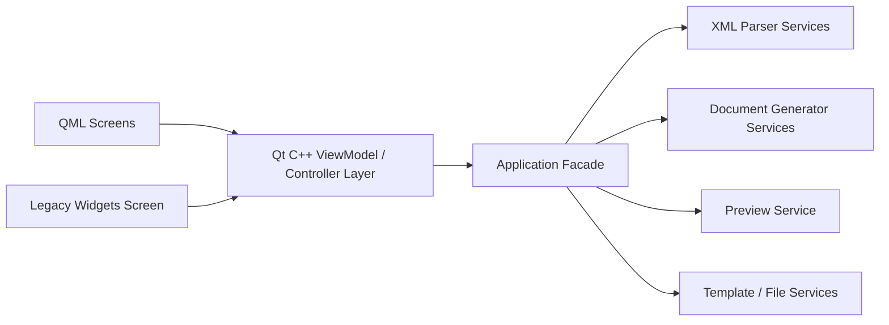
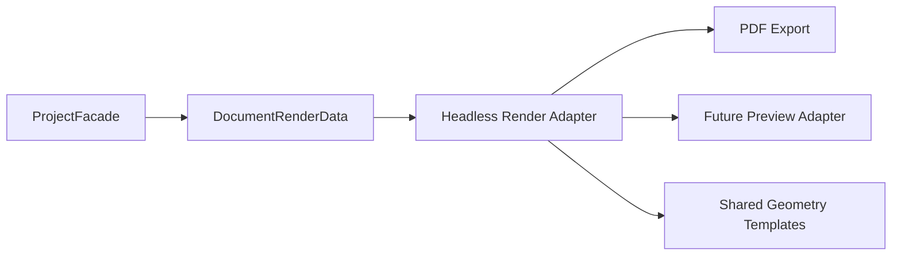

# Поэтапный hybrid-план миграции VP_merge на QML

## Выбранная стратегия

Целевой подход: **hybrid migration**.

Это означает:
- текущий Widgets-интерфейс сохраняется рабочим на переходный период
- бизнес-логика последовательно выносится из [`MainWindow`](mainwindow.h) в backend
- QML получает доступ к реальным use case через [`ProjectFacade`](backend/projectfacade.h) и [`AppController`](appcontroller.h)
- замена идёт сценарий за сценарием, без big bang переписывания

## Текущее состояние миграции

На текущий момент уже реализовано:

1. Вынесен XML-парсинг в [`XmlProjectParser`](backend/xmlprojectparser.h)
2. Введён facade приложения [`ProjectFacade`](backend/projectfacade.h)
3. QML-экран [`qml/main.qml`](qml/main.qml) умеет:
   - загружать XML
   - импортировать XML в список
   - редактировать поля проекта
   - редактировать штамп
   - подготавливать пути генерации
   - запускать генерацию `PE` / `SP` / `VP` / `GVP`
   - отображать preview-метаданные по выбранному документу
4. Генераторы документов уже переведены в backend:
   - [`PeGeneratorService`](backend/pegeneratorservice.h)
   - [`SpGeneratorService`](backend/spgeneratorservice.h)
   - [`VpGeneratorService`](backend/vpgeneratorservice.h)
   - [`GroupedVpGeneratorService`](backend/groupedvpgeneratorservice.h)
5. Реализован snapshot-слой preview/PDF-метаданных через [`DocumentRenderData`](backend/documentrenderdata.h)
6. Добавлен минимальный headless export-контур:
   - [`DocumentExportResult`](backend/documentexportresult.h)
   - [`HeadlessDocumentExportService`](backend/headlessdocumentexportservice.h)
   - facade-команда [`ProjectFacade::exportPreviewDocumentPdf()`](backend/projectfacade.cpp:553)
7. Слой QML уже перестал быть demo-заглушкой и выполняет реальный пользовательский сценарий

## Почему не стоит делать big bang migration

По текущему проекту всё ещё видно, что:

- [`mainwindow.cpp`](mainwindow.cpp) содержит крупные блоки рабочей генерации СП/ВП и групповой логики
- [`DocPainter`](docpainter.h) и [`painterPrinter`](painterprinter.h) пока остаются legacy-опорой для предпросмотра и печати
- QML пока покрывает только часть сценариев

Одновременная полная замена UI и backend привела бы к высокому риску поломки рабочего поведения.

## Целевое состояние после миграции

### Архитектурная схема

### Принципы целевой архитектуры

1. QML отвечает только за представление и взаимодействие
2. C++ слой состояния отвечает за команды и `Q_PROPERTY`
3. Use case реализуются в backend-сервисах
4. Генераторы документов не зависят от Widgets
5. Legacy UI на переходный период использует тот же backend API

## Карта сценариев для миграции

### Сценарий 1. Загрузка проекта
Уже частично перенесён в QML.

Содержит:
- ввод пути к XML
- загрузку проекта
- отображение текущего XML
- отображение кода проекта
- импорт XML в список

### Сценарий 2. Редактирование штампа и параметров проекта
Уже частично перенесён в QML.

Содержит:
- децимальный номер
- наименование проекта
- разработал
- проверил
- утвердил
- нормоконтроль
- начальник отдела
- альтернативное наименование начальника отдела

### Сценарий 3. Генерация документов
Перенесён в рабочий backend/QML-контур для базового сценария.

Уже есть:
- подготовка путей генерации
- генерация `PE`
- генерация `SP`
- генерация `VP`
- групповая генерация `GVP`
- выдача preview/PDF путей и snapshot-метаданных

Ещё предстоит:
- журнал выполнения операций
- расширенная модель результатов операций для UI
- отдельный экран групповой обработки с полной диагностикой

### Сценарий 4. Предпросмотр документов
Частично перенесён на уровень backend-метаданных.

Уже есть:
- выбор документа preview в [`qml/main.qml`](qml/main.qml)
- выдача backend snapshot-данных через [`ProjectFacade`](backend/projectfacade.h)
- отображение title / page count / format / stamp summary / путей

Ещё предстоит:
- реальный page-render без зависимости от [`DocPainter`](docpainter.h)
- QML-compatible preview bridge
- постраничная навигация и масштабирование

### Сценарий 5. Печать и PDF
Частично перенесён на уровень headless export API.

Уже есть:
- facade-команда запуска export
- headless export service-заглушка без Widgets UI
- единая точка расширения для общего PDF/preview pipeline

Ещё предстоит:
- реальный PDF renderer
- унификация геометрии страниц между preview и PDF
- отказ от legacy-зависимости на [`painterPrinter`](painterprinter.h)

## Обновлённый порядок миграции

### Шаг 1. Завершить вынос генераторов документов

1. Перенести СП в отдельный backend-сервис
2. Перенести ВП в отдельный backend-сервис
3. Перенести групповую ВП в backend use case
4. Унифицировать общие части генерации:
   - template snapshot
   - клонирование листов
   - постобработку книги
   - разбиение по страницам

### Шаг 2. Доработать facade и QML-команды

1. Расширить [`ProjectFacade`](backend/projectfacade.h) командами:
   - генерации СП
   - генерации ВП
   - групповой генерации
2. Передавать в QML не только пути, но и результаты операций
3. Добавить более явный статус выполнения и ошибки

### Шаг 3. Выделить ViewModel-слой следующего уровня

Сейчас [`AppController`](appcontroller.h) уже выполняет роль тонкого bridge-слоя.

Следующий шаг:
- разделить state по зонам ответственности
- при необходимости выделить отдельные QObject-модели:
  - `ProjectViewModel`
  - `StampViewModel`
  - `GenerationViewModel`
  - `PreviewViewModel`

Это упростит дальнейший рост QML-интерфейса.

### Шаг 4. Перенести сценарий групповой обработки в QML

Нужно реализовать:
- список XML-файлов
- список кодов проектов
- настройку режима одиночной/групповой обработки
- команду генерации групповой ВП
- отчёт о результате по группе

### Шаг 5. Перенести предпросмотр

Это наиболее сложный этап.

Рекомендуемый путь:
- сохранить рендеринг в C++
- адаптировать его для QML через `QQuickPaintedItem` или аналогичный bridge
- передавать в renderer общую модель документа, а не `ui->...`

### Шаг 6. Перенести печать и PDF на общий render pipeline

После появления shared render model:
- QML вызывает backend-команды печати
- PDF строится через тот же renderer
- экранный и печатный результат выравниваются по логике

### Шаг 6.1. Следующий переносимый backend-срез: headless render/export adapter

Статус: **выполнен как базовый каркас**.

Зафиксированный приоритет:
- строить **общий adapter** для PDF и будущего preview
- в первой реализации покрыть только `PE` / `SP` / `VP`
- `GVP` оставить отдельным следующим этапом
- не переносить сразу полный [`DocPainter`](docpainter.h) в QML-виджетный слой

Цель среза:
- убрать прямую зависимость нового render pipeline от [`QWidget`](docpainter.h:12)
- использовать уже существующие данные из [`DocumentRenderData`](backend/documentrenderdata.h) и snapshot-слоя из [`ProjectFacade`](backend/projectfacade.h)
- подготовить единое основание для headless PDF/export сейчас и экранного preview позже

Минимальная целевая схема:

Что переносится в этом этапе:
- выбор формата страницы и типа документа
- выбор шаблона первой и последующих страниц
- отрисовка рамок и статических блоков
- отрисовка табличного содержимого по [`PageContainer`](Structures.h)
- отрисовка ключевых полей штампа из `QMap<QString, QString>`

Что **не** переносится в этом этапе:
- прямой QML preview-компонент
- `QQuickPaintedItem`
- полная поддержка `GVP`
- полная замена legacy-вызовов из [`mainwindow.cpp`](mainwindow.cpp)

Предлагаемая декомпозиция:
1. Вынести общие render-структуры из legacy-логики:
   - геометрические примитивы линий
   - текстовые примитивы
   - описание шаблона страницы
2. Ввести headless renderer service в backend:
   - без наследования от `QObject`, где это не требуется
   - без зависимости от [`QWidget`](docpainter.h:12)
3. Отделить два уровня API:
   - подготовка page template по типу документа и номеру страницы
   - выполнение render/export в `QPainter` / `QPrinter`
4. Подключить facade-команду запуска PDF/export поверх этого adapter
5. После стабилизации добавить preview-bridge, использующий тот же adapter

Предлагаемый состав новых сущностей:
- `RenderTemplate` или аналогичная структура страницы
- `RenderLine`
- `RenderText`
- `DocumentRenderRequest`
- `DocumentExportResult`
- backend service уровня `HeadlessDocumentRenderer`
- facade use case уровня `exportPreviewDocumentPdf` или эквивалент

Критерии готовности этого среза:
- PDF/export для `PE` / `SP` / `VP` не зависит от [`DocPainter`](docpainter.h)
- render-логика не требует `ui->...`
- [`ProjectFacade`](backend/projectfacade.h) может запускать export headless-способом
- тот же adapter можно повторно использовать для будущего preview

Фактически реализовано в текущей итерации:
- добавлен DTO [`DocumentExportResult`](backend/documentexportresult.h)
- добавлен сервис [`HeadlessDocumentExportService`](backend/headlessdocumentexportservice.h)
- добавлена facade-команда [`ProjectFacade::exportPreviewDocumentPdf()`](backend/projectfacade.cpp:553)
- команда прокинута через [`AppController`](appcontroller.h)
- сборка актуализирована в [`CMakeLists.txt`](CMakeLists.txt)
- подтверждена пользовательская сборка без ошибок

Ограничения текущей реализации:
- export пока является stub-реализацией и не строит реальный PDF-файл
- `GVP` не выделен в отдельную специализированную headless-ветку
- геометрия из [`docpainter.cpp`](docpainter.cpp) и [`painterprinter.cpp`](painterprinter.cpp) ещё не вынесена в shared primitives

### Шаг 7. Завершить отказ от [`MainWindow`](mainwindow.h)

Удаление legacy Widgets-слоя допустимо только после выполнения условий:

- все основные пользовательские сценарии доступны из QML
- генерация PE/SP/VP/групповой VP работает через facade
- предпросмотр доступен в QML
- печать и PDF используют общий backend pipeline
- в [`mainwindow.cpp`](mainwindow.cpp) больше не остаётся уникальной бизнес-логики

## Детальный план по слоям

### Слой 1. Состояние

Нужно довести до устойчивого состояния следующие модели:
- [`ProjectData`](backend/projecttypes.h)
- [`ProjectStampFields`](backend/projecttypes.h)
- [`GenerationArtifacts`](backend/projecttypes.h)
- будущую модель grouped-generation state
- будущую preview model

### Слой 2. Backend use case

Должны существовать отдельные команды:
- загрузка проекта
- импорт списка XML
- обновление штампа
- подготовка путей генерации
- генерация ПЭ
- генерация СП
- генерация ВП
- групповая генерация ВП
- построение preview model
- печать/PDF

### Слой 3. Controller / ViewModel для QML

QML-слою должны быть доступны:
- `Q_PROPERTY` состояния
- `Q_INVOKABLE` команды
- сигналы статуса
- сигналы ошибок
- модели списков для `ListView` и `ComboBox`

### Слой 4. UI на QML

Итоговый QML-интерфейс должен включать:
- экран загрузки и состава проекта
- экран штампа и параметров генерации
- экран групповой обработки
- экран предпросмотра
- зону ошибок/статуса/журнала

## Риски миграции и меры снижения

### Риск 1. Поломка рабочей генерации Excel
**Снижение:** переносить алгоритмы сначала почти без изменения, как это уже сделано для [`PeGeneratorService`](backend/pegeneratorservice.h).

### Риск 2. Расхождение поведения legacy UI и QML
**Снижение:** все новые команды должны жить в [`ProjectFacade`](backend/projectfacade.h), а не в самих экранах.

### Риск 3. Слишком толстый [`AppController`](appcontroller.h)
**Снижение:** по мере роста QML разделить controller на несколько ViewModel по зонам ответственности.

### Риск 4. Сложность предпросмотра
**Снижение:** сначала адаптировать существующий C++ renderer в QML, а не переписывать сразу на Canvas/Scene Graph.

## Рекомендуемая последовательность реализации

1. Зафиксировать backend-паттерн, использованный в [`PeGeneratorService`](backend/pegeneratorservice.h)
2. По тому же принципу вынести СП
3. Затем вынести ВП
4. Затем перенести групповую ВП
5. После этого расширить QML до полного сценария генерации
6. Затем заняться preview
7. Затем перенести печать/PDF
8. После стабилизации удалить legacy Widgets UI

## Критерии успешной hybrid-миграции

Миграция идёт правильно, если после каждого этапа:

- приложение собирается
- новый use case появляется в backend, а не в UI
- QML использует только [`AppController`](appcontroller.h) / [`ProjectFacade`](backend/projectfacade.h)
- в [`MainWindow`](mainwindow.h) уменьшается объём прикладной логики
- генерация документов проверяется на реальных XML и шаблонах
- ошибки сценариев контролируемо показываются пользователю

## Актуальная следующая реализационная задача

Наиболее рациональный следующий шаг после текущей итерации:

1. заменить stub в [`HeadlessDocumentExportService::exportPdf()`](backend/headlessdocumentexportservice.cpp:4) на реальный PDF-render pipeline
2. вынести shared render primitives и page template layer из [`docpainter.cpp`](docpainter.cpp) / [`painterprinter.cpp`](painterprinter.cpp)
3. построить QML-compatible preview bridge поверх того же render adapter
4. добавить расширенный `operation/export result` в UI-слой
5. после стабилизации отключать legacy preview/PDF ветки по одному сценарию
